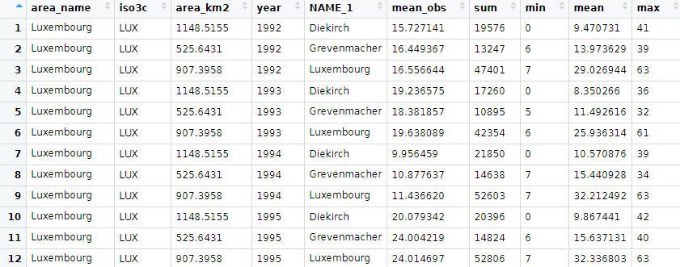
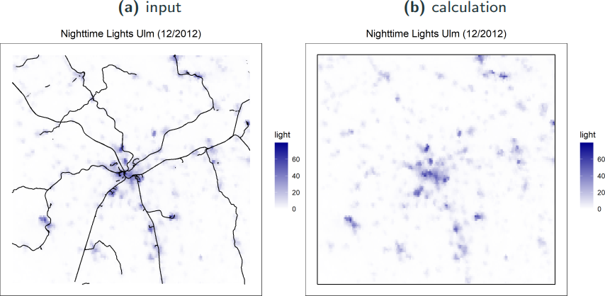

# nightlightstats

Night light satellite data can be useful as a proxy for economic activity in regions for which no GDP data are available, for example at the sub-national level, or for regions in which GDP measurement is of poor quality, for example in some developing countries (see e.g. Henderson et al., 2012).

This package was built using the code of the paper "The Elusive Banker. Using Hurricanes to Uncover (Non-)Activity in Offshore Financial Centers" by Jakob Miethe but while that paper only focuses on small island economies, this package allows construction of nightlight statistics for most geospatial units on the planet which is hopefully useful for researchers in other areas. The R package allows to perform calculations on night light satellite data and build databases for any given region using the function `nightlight_calculate`. Plots of the night lights in the desired area are also made very easy with `nightlight_plot`.

To install the package, run `devtools::install_github("JakobMie/nightlightstats")`.

You can either work with yearly DMSP data ranging from 1992 to 2013 (https://www.ngdc.noaa.gov/eog/dmsp/downloadV4composites.html - Image and data processing by NOAA's National Geophysical Data Center, DMSP data collected by US Air Force Weather Agency) or monthly VIIRS data beginning in Apr 2012 (https://eogdata.mines.edu/products/vnl/ - Earth Observation Group, Payne Institute for Public Policy, Elvidge et al., 2013). The package (if desired) automatically downloads spatial data by country for any administrative level from GADM (https://gadm.org/data.html).
 
Yearly VIIRS data are available at https://eogdata.mines.edu/nighttime_light/annual/v20/. At the moment, the package does not process these data.

If you experience trouble with the calculation capacities of your computer because the region you want to investigate is too large, you can take a look at the auxiliary function `slice_shapefile` which cuts a region into smaller pieces.

## nightlight_download

You can download DMSP night light satellite data with this function. 

Note: as the Colorado School of Mines has changed the access to their VIIRS nighttime light data to require a free user account, you have to download the VIIRS data manually via their website. For further information, see https://payneinstitute.mines.edu/eog-2/transition-to-secured-data-access/.

The yearly data are of lower resolution than the monthly data and take up less space (1 yearly DMSP image for the whole world = 1/16 space of a monthly VIIRS image for the whole world). Hence, yearly data will probably be fine on your normal drive (all years together ca. 45 GB incl. quality files), but working with monthly data likely requires an external drive (about 1.5+ TB for all files incl. quality files). Quality files (recognizable by the ending cf_cvg) show how many observations went into the value of a pixel in the aggregated night light image in a given period.

The DMSP data are available per year in one image for the whole world. The only relevant information is the timespan and the location where you want to save the images on your drive. For example, to download all of the data ranging from 1992 to 2013 at once, you can input the following into the function:

    nightlight_download(
    time = c("1992", "2013"),
    light_location = "D:/nightlights")

Monthly VIIRS images divide the whole world into 6 geographic tiles. It may happen that the region you want to analyze is overlapping on two or more of these tiles, so in order to analyze that region, you would need to download all relevant tiles. You can check which tiles to download by using the coordinates of your area, or you can just download all tiles.

## nightlight_calculate

This function allows to perform calculations on night lights of a region in a given time interval. The output will be an aggregated dataframe in your environment, or if desired an additional dataframe for each area provided in `area_names`. To get these single dataframes, you have to set the argument `single_dataframes` to TRUE.

For example, if you want to get a dataframe for the DMSP night lights in adm 1 regions of Luxembourg between 1992 and 1995, you can input:

    nightlight_calculate(
    area_names = "Luxembourg",
    time = c("1992", "1995"),
    shapefile_location = "D:/shapefiles",
    light_location = "D:/nightlights",
    admlevel = 1)

which will give you this dataframe called "lights" in the R environment:

Firstly, you get the name of the area you input in `area_names`. If there is an iso3c countrycode in case this area is a country, this will be registered and output as well. The area in square kilometers will automatically be calculated based on your shapefiles or coordinates, so you can easily integrate it into further calculations. NAME_1 indicates the names of the adm 1 regions of Luxembourg. Columns with lower-level administrative region names will only appear if you specify the administrative level in the argument `admlevel` (the default is 0, which refers to country borders for countries or does nothing in case your shapefile is e.g. a city or other region not included in a system of administrative districts). "mean_obs" refers to the mean number of observations per pixel that went into the aggregated image for a time period in a given area (taken from the quality files). Default calculations are the sum of the light values in your area and their mean. Outliers can be identfied with the minimum and maximum light values. 

You can use any desired function for the calculations. You have to load the function into your environment first in case it is a user-written function. Then, you can input the name of the R object as a string into a vector using the argument `functions_calculate`. The function has to accept an `na.rm` argument. In case it does not, you have to wrap the function accordingly. If encountering problems, check the documentation of `raster::extract`, into which all functions are fed. This function sets the conditions for which other functions than the default settings work.

Other arguments in `nightlight_calculate`, for which you can consult the helpfiles for further details about their specific usage are:

- `rawdata`: This argument allows to output a dataframe with simply the raw light pixels and their values and coordinates for each region and time period additionally to the standard processed dataframe.

- `cut_low`, `cut_high`, `cut_quality`: These arguments allow to exclude certain pixels from the calculation. If desired, any values smaller than `cut_low`, any values larger than `cut_high` and any pixels with number of observations less or equal to `cut_quality` will be set to NA. The default setting for `cut_quality` is 0, which means that pixels with 0 observations in a time period will be set to NA.

- `rectangle_calculate`: In case your shapefile does not feature an enclosed area with which calculations can be performed, the code will transform your shapefile into a rectangle based on the minimum/maximum x- and y-coordinates. If this for some reason does not work, you can set this to TRUE or FALSE manually (the default is NULL, which activates automatic detection, but for non-standard shapefiles the detection might fail). Below, you can see an illustration of what the code would do in case you input this shapefile with a non-enclosed area (the railway system of Ulm, Germany).

## nightlight_plot

This function allows to plot a shapefile with its night lights for a given period of time. Note: even though it is possible to produce multiple plots by using multiple inputs for `area_names` and a timespan for `time`, you should pay attention to the number of plots that will be produced this way - all plots will be loaded into your global environment as ggplot objects, hence a large number of objects can be loaded into your environment quickly.

The basic input arguments are the same as for the other functions. For example, if you input:

    nightlight_plot(
    area_names = "Germany",
    time = "1992",
    shapefile_location = "D:/shapefiles",
    light_location = "D:/nightlights",
    admlevel = 1),

you get the following image:

In case you want to plot a region that is not available on GADM (i.e. a region that is not a country), you must have the downloaded shapefile in your `shapefile_location`, so the function can detect it according to the name you give in `area_names`. If this fails, there is always the option to use the `shapefiles` argument and just give the filenames of the shapefiles instead (you still have to set the `area_names` for the naming of the output). This applies to `nightlight_calculate` as well.

In case you input a set of coordinates, you will get an image with a rectangular shapefile constructed from your coordinates.

## Limitations, additional notes, and alternative data sources

- The code is not explicitly written for fast performance.

- The yearly DMSP data are of suboptimal quality. Problems are for example a lower resolution and more blooming/blurring of the lights compared to the VIIRS data. Moreover, the DMSP data feature a discrete scale that is top-coded at a digital number of 63, while the VIIRS data have a continuous scale and no top-coding. Detection for low illumination ranges is also better in VIIRS.

- There is a [Matlab code](https://github.com/alexeiabrahams/nighttime-lights) to de-blur the DMSP data (see Abrahams et al., 2018).

- You could use a Pareto distribution to circumvent top-coding and extrapolate light values e.g. in city centers (see Bluhm & Krause, 2022). You can use these images by setting `corrected_lights` to TRUE. The files are available via the website of Melanie Krause at https://www.melanie-krause.de/data.html. 

- Temporal consistency is not an issue with the VIIRS data, since the light values are consistently calibrated and standardized to describe a fixed unit of radiance (nano Watts / cm2 / steradian).

- Temporal consistency can be an issue with the DMSP data. There are several versions of DMSP satellites. For some years, these versions overlap and there are two images available for a year. `nightlight_download` always downloads both. Then, for `nightlight_calculate` and `nightlight_plot`, the versions to be used will be chosen based on the timespan you input into the functions. If possible, a consistent version for your timespan will be chosen. If 2 consistent versions are available for your timespan, the newer one will be selected. If no consistent version is available, the newest version for each year will be chosen. You will be notified about the selected DMSP versions. Using just one version is generally desirable, since the light intensity scale is not consistently calibrated and the measured values could thus not be perfectly comparable across satellite versions (see e.g. Doll, 2008); values might even not be fully comparable across years within a satellite version. In an econometric analysis using DMSP data, satellite version fixed effects and year fixed effects are advisable (see e.g. Gibson et al., 2021).

- Natural factors influence data quality. Cloud coverage affects the number of observed nights that go into an aggregated image and can be especially strong in tropical regions. The data often lack values for summer months for regions close to the Poles due to stray light during summer nights. Aurora light and snowfall could influence observed lights for regions close to the Poles. These points can nicely be illustrated by looking at the mean of light values in Moscow, a bright city with a rather short distance to the North Pole. You can see that values for the summer months are not available and that values in the winter months fluctuate strongly, possibly due to disturbances caused by aurora light or varying reflection intensity of human-produced light due to variation in snowfall.

<figure>
  
  <figcaption>VIIRS Monthly light means for Moscow, non straylight-corrected version.</figcaption>
</figure>

- To increase coverage during summer months for the monthly VIIRS data, you can use a straylight-corrected VIIRS version (see Mills et al., 2013) by setting `corrected_lights` to TRUE. These are different VIIRS images, so you have to manually download them first as well.

- You can also work with a harmonized DMSP-VIIRS yearly dataset spanning from 1992 onwards (see Li et al., 2020, available at https://figshare.com/articles/dataset/Harmonization_of_DMSP_and_VIIRS_nighttime_light_data_from_1992-2018_at_the_global_scale/9828827/7). To use these data, you have to set `harmonized_lights` to TRUE in all functions. The harmonized dataset is built with the non straylight-corrected VIIRS data. The VIIRS data are cleaned from disturbances due to aurora and temporal lights and then matched to the resolution and top-coding of the DMSP data. The DMSP data are temporally calibrated to ensure temporal consistency. The data are already produced with quality weights; separate quality files are not included in the dataset. 

## References

- Abrahams, A., Oram, C., & Lozano-Gracia, N. (2018). Deblurring DMSP nighttime lights: A new method using Gaussian filters and frequencies of illumination. Remote Sensing of Environment, 210, 242-258.

- Bluhm, R. & Krause, M. (2022). Top lights - Bright cities and their contribution to economic development. Journal of Development Economics 157, 102880.

- Doll, C. (2008). CIESIN thematic guide to night-time light remote sensing and its applications. Center for International Earth Science Information Network, Columbia University, New York.

- Elvidge, C. D., Baugh, K. E., Zhizhin, M., & Hsu, F.-C. (2013). Why VIIRS data are superior to DMSP for mapping nighttime lights. Asia-Pacific Advanced Network 35(35), 62.

- Gibson, J., Olivia, S. Boe-Gibson, G. (2021). Which night lights data should we use in economics, and where?. Journal of Development Economics, 149 (102602), 1-12.

- Henderson, J. V., Storeygard, A., & Weil, D. N. (2012). Measuring economic growth from outer space. American Economic Review, 102(2), 994–1028.

- Li, X., Zhou, Y., Zhao, M., & Zhao, X. (2020). A harmonized global nighttime light dataset 1992–2018. Scientific Data, 7(1).

- Mills, S., Weiss, S., & Liang, C. (2013). VIIRS day/night band (DNB) stray light characterization and correction. Earth Observing Systems XVIII.
