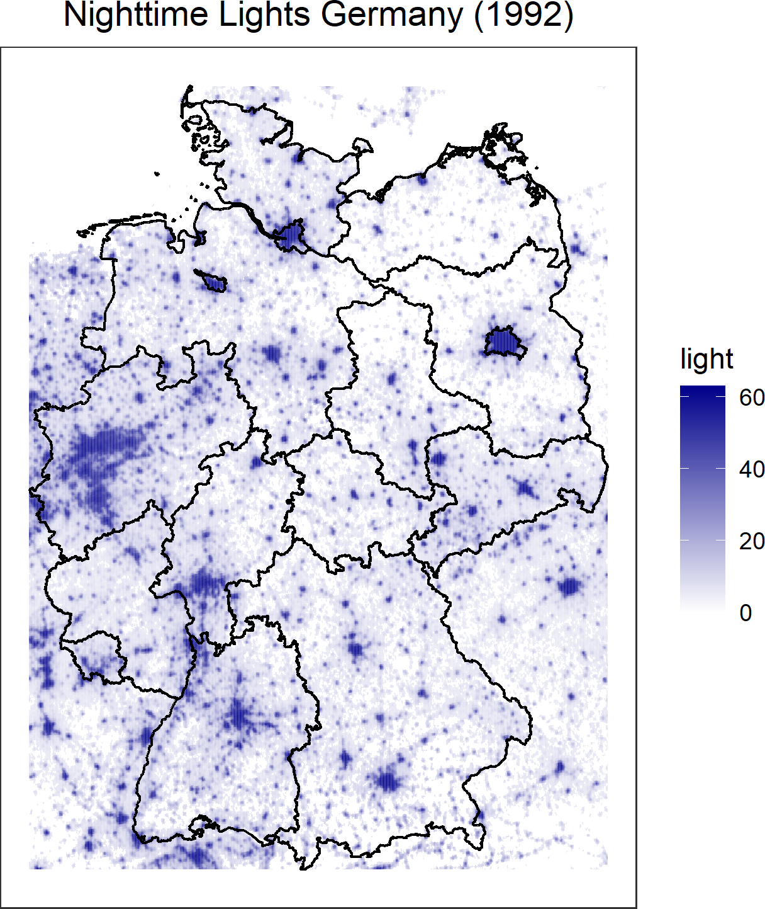

Night light satellite data can be useful as a proxy for economic activity in a region for which no GDP data are available or GDP measurement is of poor quality (see e.g. Henderson et al., 2012). 

This package allows to perform calculations on night light satellite data and build databases for any given region using the function `nightlight_calculate`. Plots of the night lights in the desired area are also made very easy with `nightlight_plot`.

You can either work with yearly DMSP data ranging from 1992 to 2013 (https://www.ngdc.noaa.gov/eog/dmsp/downloadV4composites.html - Image and data processing by NOAA's National Geophysical Data Center, DMSP data collected by US Air Force Weather Agency) or monthly VIIRS data beginning in Apr 2012 (https://eogdata.mines.edu/download_dnb_composites.html - Earth Observation Group, Payne Institute for Public Policy, NOAA/NCEI).

At the time of writing, the yearly VIIRS data is not uploaded so the package doesn't process yearly VIIRS data. Please contact the authors if you notice that this changed. You can either provide own shapefiles (region, country, etc.) or have them (in the case of countries) automatically downloaded from GADM (https://gadm.org/data.html). 

Note about the light files for `nightlight_calculate` and `nightlight_plot`: for the DMSP images, some years have 2 versions available. Generally, if possible, a consistent version for your timespan will be chosen. Otherwise the newest version for each year will be selected. If 2 consistent versions are available for your timespan, the newer one will be selected. In `nightlight_download`, all versions will always be downloaded for a given year (max. 2).

## nightlight_download

You will want to use this function first if you want to start working with night light satellite data. The function is simply a tool that facilitates downloading the data, so you don't have to do that by hand.

A note about the disk space used by the files: The yearly data is of lower resolution than the monthly data and takes up less space (1 year image for the whole world = 1/16 space of a monthly image for the whole world). Hence, yearly data will be fine on your normal drive (all years together ca. 45 GB incl. quality indicator files), but working with monthly data likely requires an external drive (about 1.5+ TB for all files incl. quality indicator files). Quality indicator files (recognizable by the ending cf_cvg) show how many observations went into the value of a pixel in the aggregated night light image. For some years, there are 2 DMSP versions available. The code downloads both.

For the yearly data, you can just use the `time` argument. The DMSP data is available per year on one image for the whole world. To download all of the data at once, you can input:

    nightlight_download(
    time = c("1992", "2013"),
    shapefile_location = "D:/shapefiles",
    light_location = "D:"/nightlights)

The monthly data is a bit more tricky. VIIRS images divide the whole world into 6 geographic tiles for each monthly image. Considering that the VIIRS data is of higher resolution and that there are more months than years, you might only need some of the data (with regards to space and time) for your research and thus could avoid going into the TB disk space range by downloading less than all of the data. You have the option of either downloading only the tile you need (by inputting geographic information, either through coordinates or using a shapefile) or by downloading all 6 tiles (by not providing geographic information). Hence, if you only want to analyze the night lights of Germany in the year 2013, you can input:

    nightlight_download(
    area_names = "Germany",
    time = c("2013-01", "2013-12"),
    shapefile_location = "D:/shapefiles",
    light_location = "D:"/nightlights)
    
or

    nightlight_download(
    time = c("2013-01", "2013-12"),
    light_location = "D:"/nightlights)
    user_coordinates = c(5.866, 15.042, 47.270, 55.057)

In the first example, the shapefile of Germany will automatically be downloaded from the GADM database (only possible for countries!), or, if there is already a shapefile for Germany in your shapefile location, it will automatically be detected. In the second example, you simply provide the minium and maximum coordinates of Germany. The downloaded tile (tile 2 in this case) of the VIIRS data will be the same, but you will have no shapefile if you only provide coordinates.

## nightlight_calculate

This function allows to perform calculations on nightlights of a region in a given time interval (defaults are sum of light values, min, mean and max, plus mean_obs, which indicates the mean number of observations (with respect to pixels) that went into the aggregated image for the time period in a given area). The output will be an aggregated dataframe in your environment with name "lights", or if desired an additional dataframe for each area with the name of the area. For this, you have to set `single_dataframes` to TRUE.

For example, if you want to get a dataframe for the DMSP night lights in adm 1 regions of Luxembourg between 1992 and 1995, you can input:

    nightlight_calculate(
    area_names = "Luxembourg",
    time = c("1992", "1995"),
    shapefile_location = "D:/shapefiles",
    light_location = "D:/nightlights",
    admlevel = 1)

which will give you this dataframe called "lights" in the R environment:

You can see that there are some useful default output elements. Firstly, you get the name of the are you input in `area_names`. If there is an ISO3 countrycode in case this area is a country, this will be registered and output as well. The area in square kilometers will automatically be calculated and output based on your shapefiles or coordinates, so you can easily integrate it into further calculations. NAME_1 in this case indicates the names of the adm 1 regions of Luxembourg. Columns with lower-level administrative names will only appear if you specify the adm level in the argument `admlevel` (default is 0, which refers to country borders for countries or does nothing in case your shapefile is e.g. a city or other region not captured by the administrative district units). Useful default calculations are the sum of the light values in your area and their mean. Outliers can easily be identfied with the minimum and maximum light values. 

You can, however, use any function for the calculations that you wish. You have to load it into your environment first in case it is user-written function. Existing functions from base R or packages work as well. Then you can input the name of the R object into a string vector using the argument `functions_calculate`. The function has to accept an `na.rm` argument. In case it doesn't, you have to wrap the function accordingly. If encountering problems, check the documentation of `raster::extract`, into which all functions are fed. The `extract` function sets the conditions for which other functions than the default settings work.

Other useful arguments in `nightlight_calculate`, for which you can consult the helpfiles for further details about their specific usage are:

- `rawdata`: This argument allows to output a dataframe with simply the raw light pixels and their values and coordinates for each region and time period additionally to the standard dataframe.

- `cut_low`, `cut_high`, `cut_quality`: These arguments allow to exclude certain pixels from the calculation. If desired, any values smaller than `cut_low`, any values larger than `cut_high` and any pixels with number of observations less or equal to `cut_quality` will be set to NA. The default setting for `cut_quality` is 0, which means that pixels with 0 observations in a time period will be set to NA.

- `rectangle_calculate`: In case your shapefile does not feature an enclosed area for which calculations can be performed, the code will automatically transform your shapefile into a rectangle based on the minimum/maximum x- and y-coordinates. If this for some reason does not work, you can set this to TRUE manually. You can see an illustration of what the code would do in case you input a shapefile with a non-enclosed area (in this case the railway system of Ulm) below.

## nightlight_plot

This function allows to plot a shapefile with its nightlights for a given period of time. Note: even though it is possible to produce multiple plots by using multiple inputs for area_names and a timespan for time, you should pay attention to the number of plots that will be produced this way - all plots will be loaded into the global environment as ggplot objects, hence a large number can load many objects into your environment quickly.

The method input of the shapefiles and times is the same as with the other functions. For example, if you input:

    nightlight_plot(
    area_names = "Germany",
    time = "1992",
    shapefile_location = "D:/shapefiles",
    light_location = "D:/nightlights",
    admlevel = 1)

You get the following image, either by already having the shapefile for Germany adm1 stored in your `shapefile_location` or by having it automatically downloaded from GADM if this is not the case:

In case you want to download a region that is not availale on GADM, you must have the shapefile in your `shapefile_location`, so the function can detect it according to the name you give in `area_names`. If this fails, there is always the option to use the `shapefiles` argument and just give the filenames.

In case you input a set of coordinates, you will get an image with a rectangular shapefile constructed with your coordinates.

## Caveats and limitations of the package and the data

- The code is not explicitly written for fast performance.

- The yearly DMSP data is of suboptimal quality. Problems are a lower resolution and more blooming/blurring of the lights compared to the VIIRS data. Moreover, the DMSP data feature a discrete scale that is top-coded at a digital number of 63, compared to the VIIRS data which have a continuous scale and no top-coding.

- You could use a pareto distribution to circumvent top coding and extrapolate light values e.g. in city centers (see Bluhm & Krause (2018) for this).

- There is a [Matlab code](https://github.com/alexeiabrahams/nighttime-lights) to de-blur the DMSP data (Abrahams et al., 2018).

- The monthly data lack summer months when a region is not close to equator due stray light on summer nights when the sun sets late. This is an issue with the DMSP data as well, but since you have yearly composite images for the DMSP data, it is not directly visible. However, fewer values of the summer months have gone into calculating the yearly composite image the further you away from the equator.

- Snowfall in winter influences the light reflection and increases brightness depending on the snowfall. This point and the previous one can nicely be illustrated by looking at the mean of light values for Moscow, a bright city with a lot of snow in winter and a large distance to the equator. You can see that the summer months are lacking and that the values in winter fluctuate strongly, which probably depends on the amount of snowfall in the respective winter months.

<figure>
  
  <figcaption>Monthly light means for Moscow.</figcaption>
</figure>

## References

- Abrahams, A., Oram, C., & Lozano-Gracia, N. (2018). Deblurring DMSP nighttime lights: A new method using Gaussian filters and frequencies of illumination. Remote Sensing of Environment, 210, 242-258.

- Bluhm, R. & Krause, M. (2018). Top Lights - Bright Cities and Their Contribution to Economic Development. CESifo Working Paper No. 7411.

- Henderson, J. V., Storeygard, A., & Weil, D. N. (2012). Measuring Economic Growth from Outer Space. American Economic Review, 102(2).
